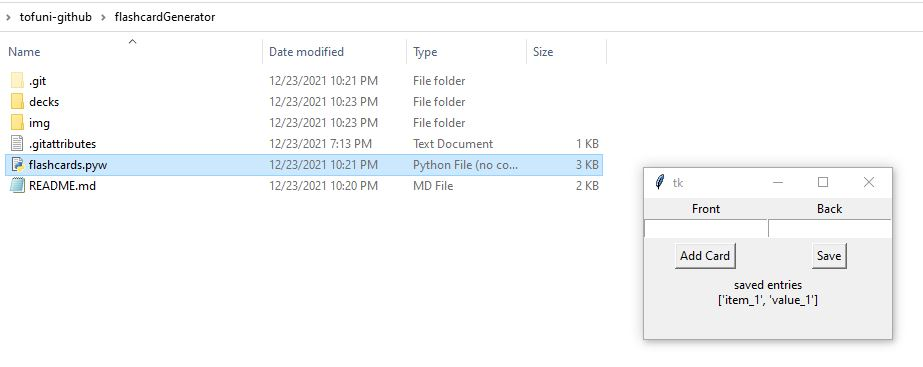
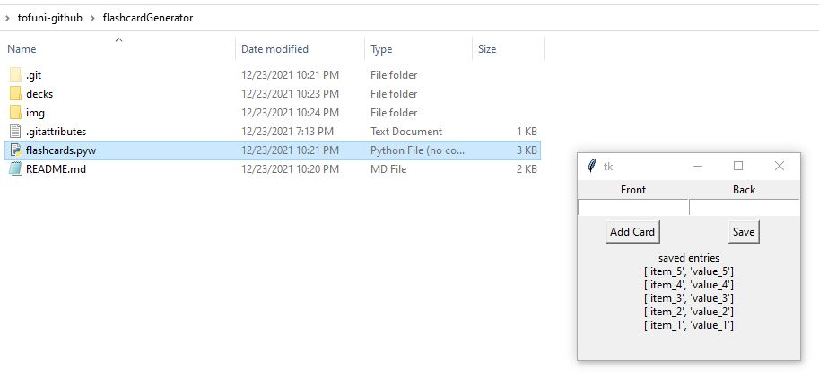
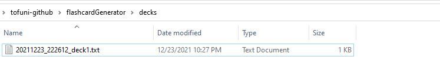
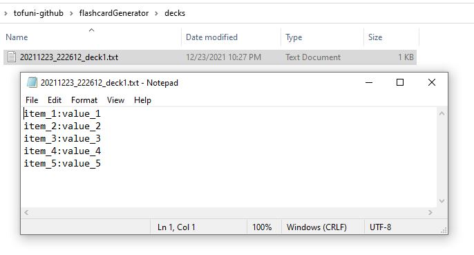
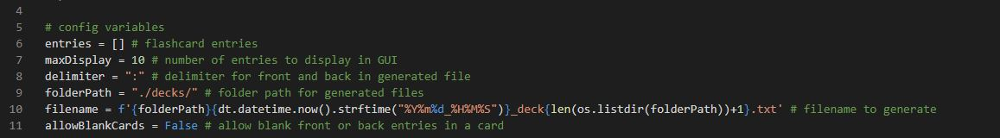

# flashcardGenerator
a widget to create flashcard decks
- the widget sticks to the top for easier access when working with multiple windows
- has configurable variables for things like naming files and delimiting front/back card entries
- example use-case: i use this to generate flashcard decks to import into Anki

-----

## Usage
1) run 'flashcards.pyw', this should bring up a GUI window

2) enter the front and back values for the flashcard as indicated by the input labels

3) click the "Add Card" button to add the card to the session

4) repeat steps 2 and 3 as needed to add cards to the session

5) when finished adding cards, click "Save and Exit"; this should close the widget and generate a flashcards file

6) navigate to the "decks" folder to view the generated flashcard files

7) the flashcard files should contain the card entries that were entered during the session with the front and back delimited (in this case the delimited is a colon ":" character)

(extra) to configure additional settings, one can modify the variables at the start of the script

